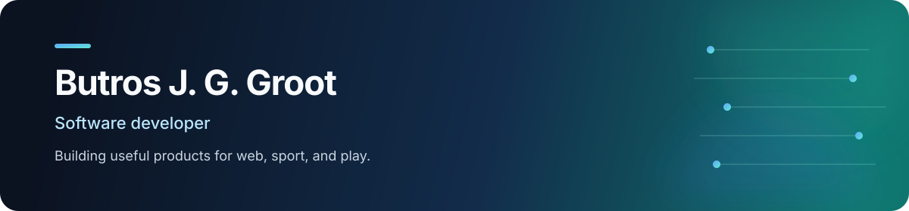

  <picture>
    <source media="(max-width: 600px)" srcset="./assets/profile-header-mobile.svg" />
    
  </picture>

  
  

## Hello 👋

I'm Butros, a software developer from the Netherlands. I like turning practical ideas into complete products—from APIs and real-time features to approachable web interfaces and reliable deployments.

My main stack is **Python, Django, React, PostgreSQL, and Docker**. I also enjoy building with **Rust** and **GameMaker** when a project calls for something different.

## Featured projects

<table>
  <tr>
    <td width="50%" valign="top">
      <h3><a href="https://github.com/butros10games/korfbal">Korfbal Web Tool</a></h3>
      
A full-stack platform for korfball clubs, with a Django REST API, React frontend, background jobs, real-time features, and a production-ready service stack.

      
<strong>Python · Django · React · Celery · Channels</strong>

      <a href="https://github.com/butros10games/korfbal">Explore the project</a>
    </td>
    <td width="50%" valign="top">
      <h3><a href="https://github.com/butros10games/BattleBot">BattleBot</a></h3>
      
A team-built robot control system using a Python client-server architecture and WebSockets, alongside hardware, PCB, and 3D-model work.

      
<strong>Python · WebSockets · Hardware · Robotics</strong>

      <a href="https://github.com/butros10games/BattleBot">Explore the project</a>
    </td>
  </tr>
  <tr>
    <td width="50%" valign="top">
      <h3><a href="https://github.com/butros10games/NatureTech">NatureTech</a></h3>
      
A Django and Tailwind web application bringing authentication, bookings, and customer and admin workflows into one product.

      
<strong>Django · Tailwind CSS · JavaScript</strong>

      <a href="https://github.com/butros10games/NatureTech">Explore the project</a>
    </td>
    <td width="50%" valign="top">
      <h3><a href="https://github.com/butros10games/gamemaker_projects">GameMaker Projects</a></h3>
      
A collection of GameMaker experiments and survival games, including <em>Space Survival</em> and <em>Try to Stay Alive</em>.

      
<strong>GameMaker · GML · Game development</strong>

      <a href="https://github.com/butros10games/gamemaker_projects">Browse the collection</a>
    </td>
  </tr>
</table>

## Toolkit

  
  
  
  
  
  
  

## Find me online

The best place to see what I'm building is **[butrosgroot.com](https://butrosgroot.com)**. You can also explore the featured projects above and follow along with the repositories here on GitHub.
